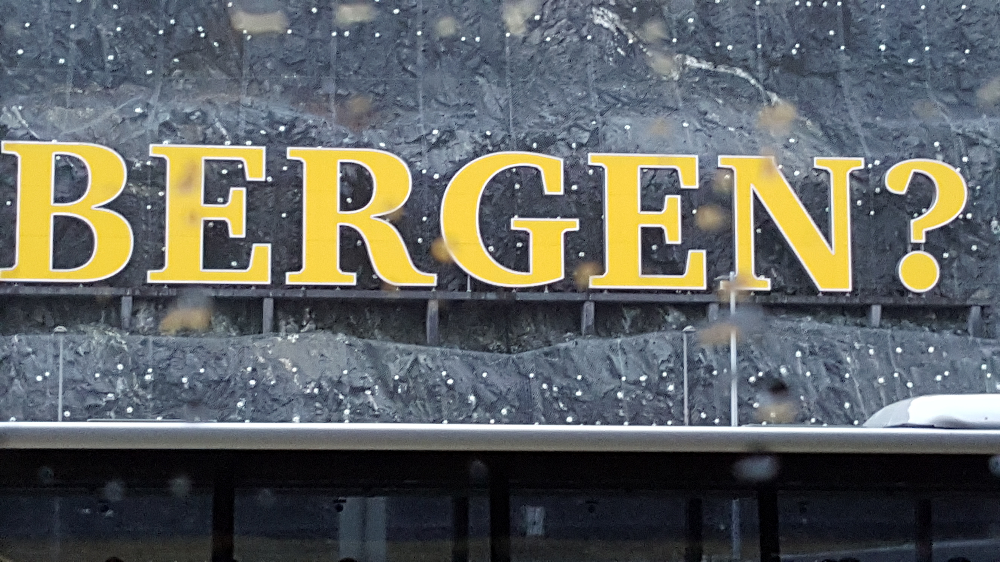

# I created a programming languages and so can you

<div class="content-warning">
  <span class="warning">Foul Language</span>
</div>

???

# The foul language is a name of a esoteric programming language

---

# Croco Loco is Turing-Complete

???

# If you have seen my earlier talks
# You might suspect this subject

---

# Nope

--

# Croco Loco is not Turing-Complete

???

# that is not true

---

# Croco Loco is a regular language

```
H(1|2|3)*T
```

???

# It is only needs a Deterministic Finite Automaton (DFA)
# Not a Turing Machine

---

<textarea id="haiku" class="haiku" rows="8" cols="30" wrap="off"></textarea>

???

# Poem celebrating a great conference
# But what is the header?

---

# [Demo](https://asciinema.org/a/S3WoUDKA2vJXQbd7qglAu9VEb)

[](https://asciinema.org/a/S3WoUDKA2vJXQbd7qglAu9VEb)

---

[](https://en.wikipedia.org/wiki/Bergen)


???

* BoosterConf 2018
* Flew in
* Greeted by iconic Bergen sign
* With Rico & Felienne
* Inspired by the sign
* Invented "Bergen, bergen, bergen"
* Itself inspired by ["Chicken Chicken Chicken: Chicken Chicken"](https://isotropic.org/papers/chicken.pdf)

---

# Esoteric programming language

> a programming language designed to test the boundaries of computer programming language design, as a proof of concept, as software art, as a hacking interface to another language (particularly functional programming or procedural programming languages), or as a joke.

???

* Software development; a narrow view what can be done
* Where is the fun?
* Where is the creativity?
* How does it work?
* How do you create a language

---

<div id="brnfck-container"></div>

???

# Target
## What machine are you targetting?
# Brainf*ck
## What is brainfuck
### Bank of registers
### Register pointer
### Instructions

---

# Language

* `>`
* `<`
* `+`
* `-`
* `.`
* `,`
* `[`
* `]`

???

* `>` -- increment pointer
* `<` -- decrement pointer
* `+` -- increment register
* `-` -- decrement register
* `.` -- ASCII output
* `,` -- ASCII input
* `[` -- jump to `]` on zero
* `]` -- jump to `[`

---


# Ook!

> Ook! is a programming language designed for orang-utans.

```plain
Ook.
Ook?
Ook!
```

--

## Map into Brainf*ck

```
    Ook. Ook? → >
    Ook? Ook. → <
    Ook. Ook. → +
    Ook! Ook! → -
    Ook. Ook! → ,
    Ook! Ook. → . 
    Ook! Ook? → [
    Ook? Ook! → ]
```

???

# Dialects

> Since the word "ook" can convey entire ideas, emotions, and abstract thoughts depending on the nuances of inflection, Ook! has no need of comments. The code itself serves perfectly well to describe in detail what it does and how it does it. Provided you are an orang-utan. 


---

# Bergen

```plain
  /\
 /  \
/    \   → >      /\         → .

  /\/\              /\  /\
 /    \            /  \/  \
/      \ → <      /        \ → ,


                    /\
 /\                /  \/\
/  \     → +      /      \   → [


                      /\
 /\/\              /\/  \
/    \   → -      /      \   → ] 
```

???

# Mapping of Bergen onto brainf*ck
# Marvel at the symmetry

---

# Create Your Own Language Guide™

--

1. Have a interesting idea

--

2. Pick a target 

--

3. Map your idea onto target

--

4. Build a translator

--

5. [Optionally] build an interpreter

--

6. ...

--

7. Fun! 
